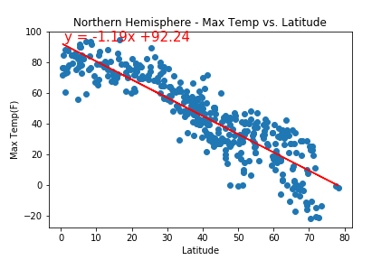
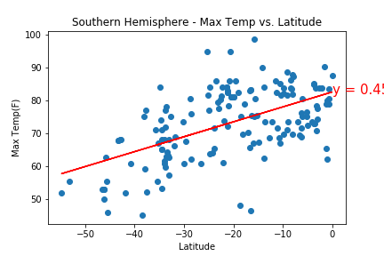
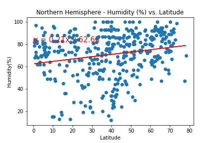
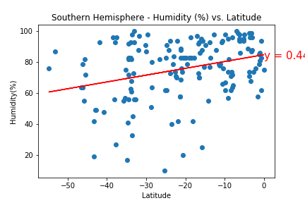
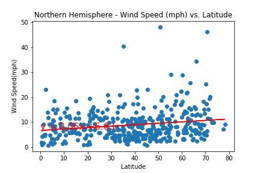

# python-api

* Comparing maximum temperatures in the northern and southern hemispheres its clear that the temperatures increase as we move closer to the equator. Cities located near equator on the southern hemisphere have slightly lower temperatures as compared to northern hemisphere.

* There is a close correlation between humidity and cloudiness, both tend to increase moving towards the north and south poles.

* Wind speed tend to be higher closer to south pole as compared to north pole. 

  

## Linear Regression

Northern Hemisphere            |  Southern Hemisphere      |   |
:-----------------------------:|:-------------------------:|---|
  |  
  |  
  |  
  |  

